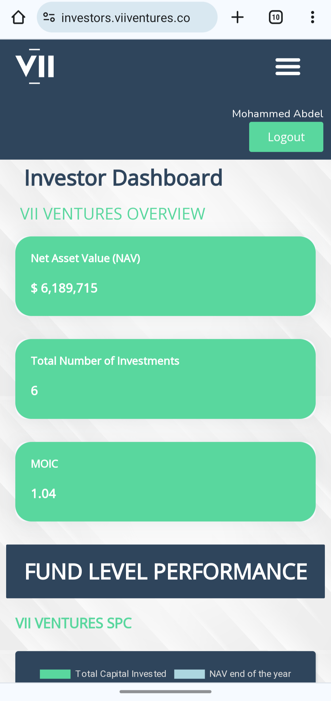
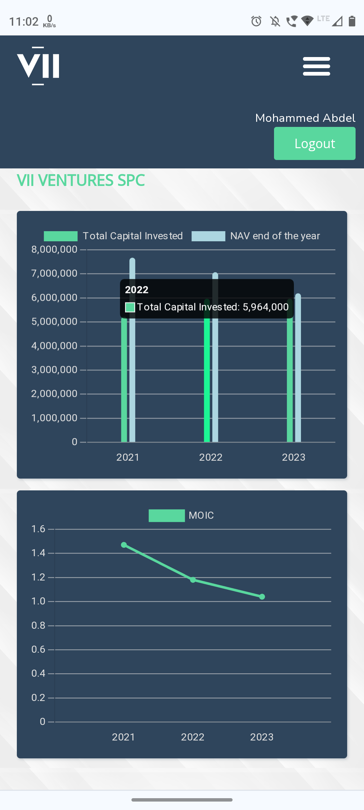

# VII Ventures Investment Dashboard

VII Ventures Investment Dashboard  is an Investment Dashboard for Financial Fund(s) management of a Venture Capital & individual Investment Portfolio management for Investors which keeps track of all of their investments using different metrics like MOIC, Portfolio Value, NAV, Profit/Loss, Region, Industry, Geography, Investment Cost, Current Value, Fund Percentage Distribution etc and display them in visually appealing format using JavaScript & jQuery libraries. 

The Dashboard has authentication which means it can only be accessed via a UserID and Password, further a user after using the Dashboard can Logout from the Dashboard which will redirect back to Login page and will clear the Login details. Dashboard has been made responsive for all devices. Investors and Portfolio Managers can download their investment detailed report in the PDF format from the report.html page.

*Desktop*


*Mobile Devices*
<p align="center">


</center>

## Demo

Video Demo of this project: https://www.youtube.com/watch?v=x7T_jwcgw2A

Doc Demo: https://bit.ly/HarshVIIVentures

## Installation

Install this project in your local development environment, follow the terminal commands:

```bash
git clone github.com/iharshka/VII-Ventures-Investment-Dashboard.git test-dashboard

cd test-dashboard
```

After this, Install a Live Server extension on your code editor, for example VS Code, follow the steps:

- Go to the _Extensions_ tab
- Search _Live Server_ and Install the first result Extension
- Now, a _Go Live_ button should be visible at the right bottom corner of VS Code Window. Clicking it will open the project on your local server on your browser.

*What if the *Go Live* button is not visible?*

- Right click on the index page and choose _Open with Live Server_
  This should open the project live in your local environment on your browser.

## Features

- Line Charts
- Bar charts
- Donut charts
- Tables
- Vector Maps
- Authorization
- Login/Logout
- Profile
- Cross platform
- Device Responsive

## Tech Stack

**Client Side**

- HTML, CSS, JavaScript
- APIs Integrations
- built on top of Chart.js/Google Chart Library
- jQuery & DataTables
- Authorization using Ajax APIs
  **Server Side**
- Python
- Django
- MongoDB

## Deployment

Live at: https://investors.viiventures.co

- Frontend hosted on _Vercel_
- Backend hosted on _AWS EC2_

## Challenges

_What hiccups did I face during the project development (and how did I overcome them?)_

- Deployment to vercel due to the messed up directory structure (put index.html on root dir)
- Async calls handling bug due to which JS behaved unexpectedly (put the APIs data dependencies inside async function)
- Adding authorization to the APIs sending username and password with the APIs (sent them in header)
- Sharing tokens across JavaScript files on client side (used LocalStorage for now)
- Customising the libraries code to the desired outcomes (took help of Chart.js Documentations & ChatGPT)
- Adding hover tip to the pie charts (Added it with <div> and DOM manipulation)

## Lessons Learned

_What did I learn while building this project?_

- I learnt how to keep the directory structure deployment & development friendly
- I learnt how to display data in a graph, donut, bars, pie and tabular format, which can be built on some available libraries
- I learnt to integrate APIs into these components
- I learnt how to handle asynchronous calls
- I learnt to use Chrome Developer tool (console/network tabs) efficiently
- I learnt about how to add authorization to GET APIs
- I learnt how to understand the given codebase and contribute to it
- I learnt to use the best possible libraries & docs to use in the project for extra functionalities e.g. jQuery used for Animated World Map for showing investment made in the regions

## Future Updates

- Adding Password change functionality for users (with a dropdown in the profile section)
- **Major change** is adding user specific dashboard, for e.g. showing fund1spc only to specific set of users

## 🚀 About Me

I'm Harsh, a problem solver, frontend developer & DevOps Eg, soon to be on backend and new techs (#Web3?, adaptive, u say). I want to work on a problem statement where I can cater to hundred thousands or million people or the one which keeps me stay up all night. Thank you for showing interest on this project. Neverming connecting with me on socials. See you soon.

[](https://iharshka.vercel.app/)[](https://www.linkedin.com/in/iharshka)[](https://twitter.com/iharshka)
